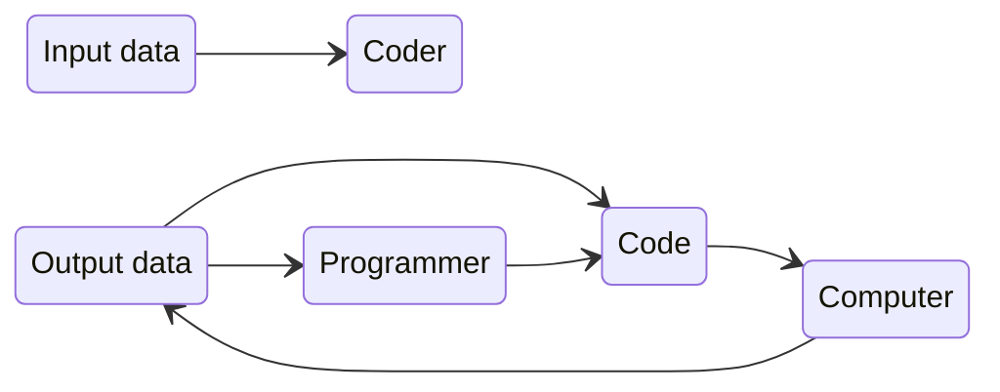
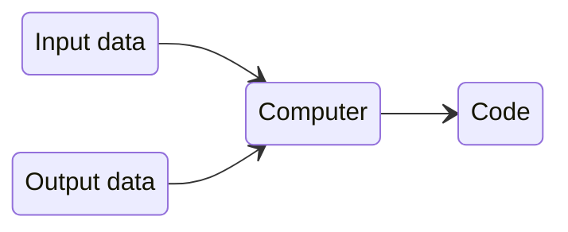

## Introduction to Machine Learning

---

# What is Machine Learning?

# And how is it related to artificial intelligence?

<figure>
  
  <figcaption style="color:#b3b3b3ff; font-size: 11px; position: absolute;">Images source: Midjourney 6
    </figcaption>
</figure>

<figure>
  
</figure>

<figure>
  
</figure>

 

<figure>
  
</figure>

<figure>
  
</figure>

---

# What is Machine Learning?
 
 
  <figure>
    
  </figure>

---
layout: quote
---

## *"Programming computers to learn from experience should eventually eliminate the need for much of this detailed programming effort."*
 

 Arthur L. Samuel (1959)*

 
 
 
 
 
 
 
 
 

##### * Arthur L. Samuel, “Some studies in machine learning using the game of checkers", *IBM Journal of research and development* 3.3 (1959), pp. 210-229

---

## Traditional Programming Paradigm
 
<v-click>

</v-click>
 
 
<v-click>

## Machine Learning Paradigm
 

##### *Machine learning is the field of study that gives computers the ability to learn without being explicitly programmed*
</v-click>

---
layout: quote
---

## *"A computer program is said to learn from experience **E** with respect to some class of tasks **T** and performance measure **P** if its performance at tasks in **T**, as measured by **P**, improves with experience **E**."*

 Tom M. Mitchell  (1997)

 

### Consider the task of recognizing handwritten digits

<figure>
  
  <figcaption style="color:#b3b3b3ff; font-size: 11px;">Examples of handwritten digits from the MNIST dataset
  </figcaption>
</figure>

Where:
* Experience **E**: [MNIST](https://en.wikipedia.org/wiki/MNIST_database) dataset
* Task **T**: digit classification in images
* Мера качества **P**: fraction of correctly classified images

---
zoom: 1.05
---

# Connection between ML and Mathematics
<v-clicks depth="3">

- **Mathematical statistics and probability theory**
  - Uncertainty estimation, representation of noisy data

- **Linear algebra**
  - Compact representation of linear data transformations
  - Dimension reduction methods

- **Other areas of mathematics**
  - Properties of functions, optimization theory, convergence and approximation guarantees

- In addition, **knowledge of the subject area** of machine learning application is required.
  - Physics, linguistics, geology, genetics, medicine, etc.

</v-clicks>

---

# Why do we need math in machine learning?
 
<v-clicks>

### Suppose your model shows $81\%$ accuracy
 

### Now what?

* Is this good/bad, useful/useless?
* Can it be improved?
* If so, to what extent?
 
 

### Machine learning and statistical theory provide answers to these questions
</v-clicks>

---

# Why do we need Math in Machine Learning?

### Mathematics helps:

<v-clicks depth="2">

* To choose:
  * **the right algorithm** for solving a problem
  * **the best hyperparameters**
  * **validation** (verification) strategies for a model

* Recognize and eliminate **underfitting** and **overfitting**

* **Eliminate problems** with poor and ambiguous results

* Assess forecast uncertainty

* **Optimize algorithms** and build effective program code
  * Models must be (economically) viable
</v-clicks>

<v-click>

#### Every decision you make in machine learning requires understanding
</v-click>

---

# What is Machine Learning?
 
 
 
 

## Machine learning is a set of methods   for finding **unknown functions** from observations

---

# Selection of Unknown Functions

* Need to match the appropriate function to the observed data
* Problems:
  * There are infinitely many such functions
  * Which one is the “right” one?
  * It is often impossible to manually search the data
    * Millions of observations
    * Thousands of features

 

#### The problems to which machine learning is applied  do not have a "correct" solution
 

Image source: <a href="https://xkcd.com/2048/">https://xkcd.com/2048</a>

<figure>
  
</figure>

<!--
Machine learning is nothing more than fitting the right function to the observed data.
But, come on! There are infinitely many such functions. In the comic on the right, the red lines show 12 functions describing the same data. How different they are! Which one should you choose? Often manual selection of functions is not possible.

An interesting consequence of all this is that problems to which machine learning is applied often have no correct or reference solution.
-->

---

# Even 2D functions can be complicated

<figure>
  
  <figcaption style="color:#b3b3b3ff; font-size: 11px; float: left;">Image source: <a href="https://www.dreamstime.com/wireframe-mesh-surface-d-illustration-image127415228">https://dreamstime.com/wireframe-mesh-surface-d-illustration-image127415228</a>
    </figcaption>
</figure>

---

# Example of Machine Learning Task

 

<figure>
  
  <figcaption style="color:#b3b3b3ff; font-size: 11px; position: absolute;">Image source: Midjourney 6
    </figcaption>
</figure>

### [Advertising](https://www.statlearning.com/s/Advertising.csv) dataset
 

### **Goal** - increase sales of a certain product depending on the advertising budget

---

# Example of Machine Learning Task

### **Goal** - to increase sales of a certain product

* We have a budget for advertising on television, radio, and in newspapers (indicators)
* It is necessary to determine the relationship between the advertising budget and sales
* Which indicator has the strongest influence on the target variable?

* How should the budget be allocated 
to increase sales? 

<figure>
   
  
</figure> 

  <figure>
    
  </figure>   

---

# What is Machine Learning?

### In general:
<v-clicks depth="2">

* Let $X$ be a **data matrix** with $N$ observations (points, cases)  and $p$ features (predictors, features):
$$X = [X_1, X_2, ..., X_p] \in \R^{N \times p}$$

* Let $Y$ be a vector of **answers** with $N$ corresponding labels: $Y \in \R^N$

* We want to find a **fixed** but **unknown** function $f$:
$$Y = f(X) + \varepsilon$$

* Where $\varepsilon$ is an **independent** random variable with the following properties:
$$\varepsilon \perp\!\!\!\!\perp X_i, ~~ \mathbb{E} \varepsilon = 0, ~~ \mathbb{V} \varepsilon < \infty$$

</v-clicks>

---

# Why to Estimate $f$?

<v-clicks depth="3">

* Prediction
  * $\hat{f}$ is an uninterpretable **black box**
  * We are looking for the best **predictions** for the available $X$
  * The goal is to reduce **avoidable** error

  <figure>
    
  </figure>

* Inference
  * $\hat{f}$ is an interpretable **white box**
  * We want to:
    * understand how **sensitive** $Y$ is to changes in $X$
    * find **important** features
    * determine whether $f$ is a **linear** or more complex function
      * Linear models are easier to interpret

  <figure>
    
  </figure>

</v-clicks>

---

# How to Estimate $f$?

* Most machine learning methods estimate $\hat{f}$  from **training observations** $(x_i^\prime, y_i^\prime) \in \R^{p+1}$
  * $x_i^\prime$ - $i$-th vector of feature values

   
<figure>
  
</figure>   

---

# How we Estimate Errors?

<v-clicks>

* In **regression** problems (i.e., where $Y$ is a continuous variable), we use the square of the difference (or **mean square error**, $MSE$):
$$\mathcal{L}_{MSE} (y, f(X)) \overset{\Delta}{=} \big(y - f(X)\big)^2$$

* In **classification** problems (i.e., where $Y$ is a categorical variable),  we use **Accuracy** (or **error rate**, or **loss** $0-1$):
$$\mathcal{L}_{acc} (y, f(X)) \overset{\Delta}{=} I\big(f(X) \neq Y \big)$$

* In both cases, we average the errors across all observations, assuming that they are **i.i.d.**  (= independent and identically distributed): 
$~~~~~~~~~~~~~~~~~~~~~~~~~~\mathcal{L} (D, f) \overset{\Delta}{=} \mathbb{E}_{(X,y) \sim D} \mathcal{L}\big(y, f(X)\big) \approx \frac{1}{N}\sum\limits_{i=1}^N \mathcal{L}\big(y_i, f(X_i)\big)$
</v-clicks>

---

# Reducible and Irreducible Errors

* Often, $f \in \mathcal{F}$, a certain **family** (**class**) of functions
* $\mathcal{F}$ can be constant, stepwise, linear, quadratic, ...

* The choice of $\mathcal{F}$ determines the **eliminable** error.
  * Example: $\hat{f}_{\mathrm{step}}$ produces larger errors than $\hat{f}_{\mathrm{linear}}$.
  * Example: $\hat{f}_{\mathrm{linear}}$ produces larger errors than $f$.

* **Irreducible** error (**noise**) $\varepsilon$ arises due to:
  * omitted variables
  * measurement errors
  * ...

   
<figure>
  
</figure>   

---

# Error Decomposition

* If we assume fixed  $\hat{f}$ and $X$, then for $\hat{Y} := \hat{f}(X)$, the mean square error will be:  
$\mathbb{E}\big[Y - \hat{Y}\big]^2 = \mathbb{E}\big[f(X) + \varepsilon - \hat{f}(X)\big]^2 =
\color{grey}\underbrace{\color{green} \big[f(X) - \hat{f}(X) \big]^2}_{\mathrm{reducible~error}}
\color{#006}{~~~~~~+~}
\color{grey}\underbrace{\color{red} \mathbb{V}\varepsilon}_{\mathrm{irreducible~error}}$ 

 

* Where $Y$ is a random variable, since it is a linear combination of random variables $\varepsilon$
  * $\mathbb{E}$ is expressed as a probability density function $Y$ (or $\varepsilon$)
  * $\mathbb{V}\varepsilon$ is the variance of $\varepsilon$

---

# Example of a Machine Learning Task
### **Goal**: to find the relationship between income and length of education
 

<figure>
  
</figure> 

<figure>
  
</figure>   

---

# Example of a Machine Learning Task
### **Цель**: find the relationship between income and length of education and seniority
 

<figure>
  
</figure> 

<figure>
  
</figure>   

 
<v-clicks>

* The process of evaluating $f$ is called **model fitting**
* To evaluate the quality of training, the **residual** $r(x) = y - f(x)$ is used
</v-clicks>